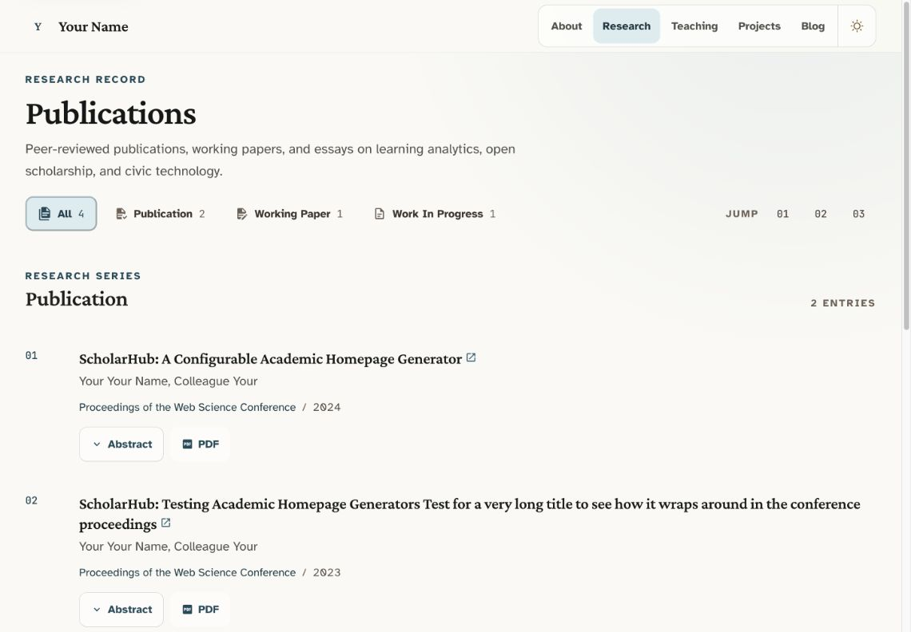

[English](./README.md) · [简体中文](./README.zh-CN.md)

# Scholar Pages

A refined Astro theme for academic portfolios, research profiles, and personal
scholar websites.

Scholar Pages keeps the site itself fast and focused while making the content
easy to maintain. Profile details live in one TypeScript configuration file;
publications, projects, teaching records, and posts stay in familiar BibTeX,
YAML, and Markdown files.


## Highlights

- **Designed for academic work** — present publications, appointments,
  teaching, projects, service, awards, and research notes in a consistent
  editorial layout.
- **Content-first workflow** — manage publications with BibTeX, structured
  records with YAML, and posts with Markdown or MDX.
- **Responsive and theme-aware** — polished desktop and mobile layouts with
  light and dark modes.
- **Useful research navigation** — filter publications, projects, and teaching
  records, then jump directly to a section.
- **Flexible home page** — enable or hide the hero, selected publications, and
  latest posts without editing page templates.
- **SEO-ready output** — canonical URLs, Open Graph metadata, JSON-LD, sitemap,
  and generated `robots.txt` are included.
- **Built for long-term use** — downstream sites can receive versioned template
  updates while preserving personal content.

## More previews

### Publications and filters



### Mobile dark mode

<p align="center">
  
</p>

## Quick start

### Requirements

- [Node.js](https://nodejs.org/) 22.13 or newer
- [pnpm](https://pnpm.io/) 11 or newer

### Install and run

```bash
git clone https://github.com/jxpeng98/astro-theme-scholars.git
cd astro-theme-scholars
pnpm install
pnpm dev
```

Open [http://localhost:4321](http://localhost:4321) to view the site.

Before publishing, replace the sample identity, links, and content. A useful
order is:

1. Update `author`, `siteUrl`, and `hero` in `site.config.ts`.
2. Replace `public/profile.svg` with your portrait or update `hero.profileImage`.
3. Add your publications to `src/data/publications.bib`.
4. Edit the YAML records in `src/data/`.
5. Replace or remove the sample posts in `src/content/posts/`.

Run `pnpm verify` when you are ready to deploy.

## Where to edit

| What you want to change | File |
| --- | --- |
| Name, profile, affiliations, links, SEO, and page introductions | `site.config.ts` |
| Publications and working papers | `src/data/publications.bib` |
| Biography, experience, education, service, and awards | `src/data/about.yml` |
| Research and software projects | `src/data/projects.yml` |
| Current and past teaching | `src/data/teaching.yml` |
| Blog posts and research notes | `src/content/posts/*.{md,mdx}` |
| Profile image and other static assets | `public/` |
| Colors, typography, icons, and reusable style tokens | `uno.config.ts` |

## Site configuration

`site.config.ts` is the main entry point for routine personalization.
`defineSiteConfig` fills in sensible defaults for navigation, page titles,
footer copy, image dimensions, and home-page section labels.

```ts
import { defineSiteConfig } from "./src/config/site";

export const siteConfig = defineSiteConfig({
  author: "Your Name",
  siteUrl: "https://your-site.example",
  hero: {
    headline: "A concise statement of your research focus.",
    subheadline: "A short biography describing your work and interests.",
    profileImage: "/profile.jpg",
    statusBadge: "Open to collaboration",
  },
  affiliations: [
    {
      role: "Assistant Professor",
      department: "School of Information",
      institution: "University Name",
      url: "https://example.edu",
    },
  ],
  researchInterests: [
    "Learning Analytics",
    "Human-Computer Interaction",
  ],
  socialLinks: [
    {
      label: "Google Scholar",
      href: "https://scholar.google.com/...",
      icon: "i-academicons:google-scholar",
    },
    {
      label: "GitHub",
      href: "https://github.com/your-handle",
      icon: "i-mdi:github",
    },
  ],
  homeBlocks: {
    hero: { enabled: true },
    publications: { enabled: true },
    posts: { enabled: true },
  },
});

export default siteConfig;
```

`siteUrl` is the source of truth for canonical URLs, Open Graph URLs,
`robots.txt`, and the sitemap. Set it to the final production address before
deploying.

## Managing content

### Publications

Add publications to `src/data/publications.bib`. Standard BibTeX fields are
supported, plus a `public` field used to group records on the research page.

```bibtex
@inproceedings{key2026paper,
  title = {Your Paper Title},
  author = {Last, First and Other, Author},
  booktitle = {Conference Name},
  year = {2026},
  url = {https://doi.org/...},
  abstract = {A short abstract.},
  public = {yes},
  keywords = {keyword1, keyword2}
}
```

| `public` value | Display group |
| --- | --- |
| `yes` | Publication |
| `wp` | Working Paper |
| `wip` | Work in Progress |
| Any other value or omitted | Other |

Entries marked `public = {yes}` are eligible for the selected-publications
section on the home page.

### About, projects, and teaching

The files in `src/data/` use YAML so records remain readable and easy to
reorder. The included examples document the available fields:

- `about.yml` supports profile facts, experience, education, service, and
  custom sections such as awards or talks.
- `projects.yml` supports status, period, descriptions, badges, highlights,
  metadata, technologies, and multiple links.
- `teaching.yml` separates current and past terms and supports course codes,
  summaries, tags, highlights, and links.

Most optional fields can be omitted; empty elements are not rendered.

### Posts

Create a Markdown or MDX file in `src/content/posts/`:

```yaml
---
title: "Post title"
description: "A short summary."
publishedAt: 2026-01-15
updatedAt: 2026-02-03
tags:
  - methods
  - open-science
draft: false
---
```

Set `draft: true` to keep a post out of the generated site.

## Included pages

| Route | Purpose |
| --- | --- |
| `/` | Profile, research interests, selected publications, and latest posts |
| `/about` | Profile facts, experience, education, service, and custom sections |
| `/researches` | Filterable publications grouped by research status |
| `/teaching` | Current and past teaching grouped by term |
| `/projects` | Active and past projects with metadata and links |
| `/posts` | Posts grouped by year |
| `/posts/[slug]` | Individual Markdown or MDX post |

## Project structure

```text
.
├── public/                    # Static images and icons
├── docs/screenshots/         # README previews
├── site.config.ts            # Main site configuration
├── src/
│   ├── components/           # Shared page and filter components
│   ├── config/               # Configuration defaults
│   ├── content/posts/        # Markdown and MDX posts
│   ├── data/                 # BibTeX and YAML content
│   ├── layouts/              # Shared page shell
│   ├── lib/                  # Content and SEO helpers
│   └── pages/                # Astro routes
├── astro.config.ts
├── uno.config.ts
└── package.json
```

## Commands

| Command | Description |
| --- | --- |
| `pnpm dev` | Start the development server |
| `pnpm build` | Build the static site into `dist/` |
| `pnpm preview` | Preview the production build locally |
| `pnpm test` | Run unit tests |
| `pnpm astro check` | Run Astro and TypeScript checks |
| `pnpm verify` | Run tests, checks, build, and generated-site assertions |

## Deployment

Scholar Pages builds to a static `dist/` directory:

```bash
pnpm verify
pnpm build
```

Deploy `dist/` to any static host, including Cloudflare Pages, Vercel, Netlify,
or GitHub Pages. Use `pnpm build` as the build command and `dist` as the output
directory.

## Template updates

Releases use SemVer tags such as `v0.5.0`. Sites created from the GitHub
template can keep `.github/workflows/template-update.yml`; it checks for newer
upstream releases and opens an update pull request while preserving the
personal paths listed in `.template-sync.json`.

Template maintainers can validate a release with:

```bash
node scripts/check-release.mjs --tag v0.5.0
pnpm verify
```

Keep `package.json`, `.template-version`, and the latest `CHANGELOG.md` entry on
the same version.

## Contributing

Issues and pull requests are welcome. For significant changes, open an issue
first so the intended behavior and scope can be discussed.

## License

Released under the [MIT License](./LICENSE).
